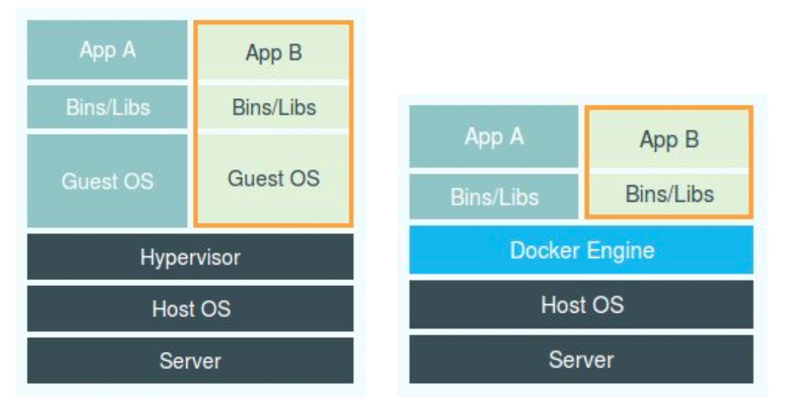

# 容器概念入门篇

## 05 | 白话容器基础（一）：从进程说开去

### 5.1 概念理解

容器技术的三个事实：
```
容器技术的兴起源于 PaaS 技术的普及；
Docker 公司发布的 Docker 项目具有里程碑式的意义；
Docker 项目通过“容器镜像”，解决了应用打包这个根本性难题。
```


很重要的一句话：

> 容器本身没有价值，有价值的是“容器编排”。

也因为如此，爆发了容器编排的战争，最后以kubernetes和CNCF社区的胜利为告终。

**在本章节主要来介绍容器技术的实现原理**

容器是一种沙盒技术，会提供两个能力：
> 1. 沙盒像集装箱一样，可以把你的应用装起来。应用与应用之间因为有了边界而不相互干扰
> 2. 被装进集装箱的应用，可以被方便的搬来搬去。

所以，对于进程来说，它的静态表现就是程序，平常都安安静静地待在磁盘上；
而一旦运行起来，它就变成了计算机里的数据和状态的总和，这就是它的动态表现。

而容器技术的核心功能，就是通过约束和修改进程的动态表现，从而为其创造出一个“边界”。

**对于 Docker 等大多数 Linux 容器来说，Cgroups 技术是用来制造约束的主要手段，而 Namespace 技术则是用来修改进程视图的主要方法。**

### 5.2 实践操作

1.在本地起一个busybox容器：

```shell
docker run -it busybox /bin/bash
```
其中，**-it**参数告诉Docker项目在启动容器后，需要给我们分配一个文本输入/输出的环境，
也就是TTY，跟容器的标准输入相关联，这样我们就可以和Docker容器进行交互了。


2. 在容器中执行**ps**命令
```shell
/ # ps
PID   USER     TIME  COMMAND
    1 root      0:00 /bin/sh
    8 root      0:00 ps
```
这个容器一共有两个进程在运行，也就意味着，前面执行的/bin/bash，和当前执行的ps，已经被Docker隔离在一个与宿主机完全
不相同的世界中了。

这种机制，其实就是对被隔离应用的进程做了手脚，使得进程只能看见重新计算过的进程编号，如PID=1。
**这种技术，就叫做Namesapce**。

3. linux系统中创建线程的系统调用

一般来说，linux创建线程的系统调用如下：
```
int pid = clone(main_function, stack_size, SIGCHLD, NULL);
```
也可以在调用时选择**CLONE_NEWPID**参数：
```shell
int pid = clone(main_function, stack_size, CLONE_NEWPID | SIGCHLD, NULL);
```
这时，新创建的这个进程将会“看到”一个全新的进程空间，在这个进程空间里，它的 PID 是 1。

之所以说“看到”，是因为这只是一个“障眼法”，在宿主机真实的进程空间里，这个进程的 PID 还是真实的数值，比如 100。

4. PID Namespace

**除了PID Namespace以外，还有Mount、UTS、IPC、Network 和 User 这些 Namespace，
用来对各种不同的进程上下文进行“障眼法”操作。**

**容器，就是一种特殊的进程而已。**

### 5.3 总结
下面图为虚拟机与容器的比对：


左图中，Hypervisor 是虚拟机最重要的部分，它通过硬件虚拟化功能，模拟出了一个操作系统的多个硬件，比如CPU，内存，IO设备等。
然后，它在这些虚拟的硬件上安装了一个新的操作系统，即 Guest OS。

而有图中，则用一个名为 Docker Engine 的软件替换了 Hypervisor。这就是很多人说Docker项目称为"轻量级"虚拟化技术的原因。
他们是把虚拟机的概念套用到了容器上。

理解Namespace工作方式后就会知道，Dockerx项目帮助用户启动的，还是原来的进程，只不过在创建这些进程时，Docker为他们加了
各种各样的参数。

**这时，这些进程会觉得自己是各自Namespace的第1号进程，只能看到各自Mount Namespace里挂载的目录和文件，
只能访问到Network Namespace里的网络设备，就仿佛运行在一个个"容器"里面，与世隔绝。**

其实都是障眼法罢了。

## 06 | 白话容器基础（二）：隔离与限制

### 6.1 Namespace的理解

通过上一章节可以了解，**Namespace技术实际上修改了应用进程看待整个计算机"视图"，即它的视线
被操作系统做了限制，只能看到某些指定的内容。** 对于宿主机而言，这些进程与其他进程没有什么区别。

不应该把Docker Engine或任何容器工具放在跟Hypervisor相同的位置，因为他们不像Hypervisor那样
对应用进程隔离环境负责，也不会创建任何实体的容器，**真正对隔离环境负责的是操作系统本身。**


**在这个对比图中，我们不应该吧Docker Engine放在与Hypervisor同样的位置，而是应该把Docker放在与
应用同级别并且靠边的位置。这意味着，用户运行容器里的应用进程与运行主机上的其他进程一样，都是由宿主机
统一进行管理，只不过这些被隔离的进程拥有额外设置过的Namespace参数。**


这是因为，使用虚拟化技术作为应用沙盒，就必须要由 Hypervisor 来负责创建虚拟机，这个虚拟机是真实存在的，
并且它里面必须运行一个完整的 Guest OS 才能执行用户的应用进程。这就不可避免地带来了额外的资源消耗和占用。

根据实验，一个运行CentOs的KVM虚拟机启动后，在不做优化的情况下，虚拟机自己会占用100MB-200MB的内存，
此外，用户应用在虚拟机里，它对宿主机操作系统的调用就不可避免的要经过虚拟化软件的拦截和处理，它本身又是一层
性能损耗，尤其对计算资源，磁盘、网络I/O的损耗都非常大。
相比而言，容器化的用户应用依然是宿主机上的一个进程，虚拟化的损耗都是不存在的；而另一方面，使用Namespace作为隔离
手段的容器并不需要单独的Guest OS，使得容器额外的资源占用可以忽略不计。

**不足之处就是：隔离的不够彻底**

```
1. [共享宿主机内核] 共享宿主机内核：在Windows宿主机上运行Linux容器、在Linux宿主机运行Windows容器是行不通的。
2. [一些不能Namespace化的资源] 在Linux内核中，有很多资源是不能被Namespace化的，比如时间。在容器部署的时候什么可以做什么不可做，是需要谨慎考虑的问题。
3. [安全] 由于共享宿主机内核，所以暴露出来的攻击面是相当大的，应用"越狱"的难度自然比虚拟机低的多。

```
关于安全问题：
> 可以通过**Seccomp**等技术对容器内部发起的所有系统调用进行过滤与甄别来进行安全加固，，但这种方法因为多了一层对系统调用的过滤，必然会拖累容器的性能。

因为安全问题，没有人敢把运行在物理机上的Linux容器直接放到公网上。**后面会讲到虚拟化独立内核技术的容器实现，则可以很好的在隔离与性能之间做出选择。**

### 6.2 Cgroup的理解

**说完隔离后，说限制**

Linux Cgroups 的全称是 Linux Control Group。它最主要的作用，就是限制一个进程组能够使用的资源上限，
包括 CPU、内存、磁盘、网络带宽等等。

在Linux中，Cgroups给用户暴露出来的操作接口是文件系统，即它以文件和目录的方式组织在操作系统/sys/fs/cgroup路径下，在Ubuntu环境下，执行如下：

```
➜  ~ mount -t cgroup
cgroup on /sys/fs/cgroup/systemd type cgroup (rw,nosuid,nodev,noexec,relatime,seclabel,xattr,release_agent=/usr/lib/systemd/systemd-cgroups-agent,name=systemd)
cgroup on /sys/fs/cgroup/net_cls,net_prio type cgroup (rw,nosuid,nodev,noexec,relatime,seclabel,net_prio,net_cls)
cgroup on /sys/fs/cgroup/perf_event type cgroup (rw,nosuid,nodev,noexec,relatime,seclabel,perf_event)
cgroup on /sys/fs/cgroup/memory type cgroup (rw,nosuid,nodev,noexec,relatime,seclabel,memory)
cgroup on /sys/fs/cgroup/pids type cgroup (rw,nosuid,nodev,noexec,relatime,seclabel,pids)
cgroup on /sys/fs/cgroup/cpuset type cgroup (rw,nosuid,nodev,noexec,relatime,seclabel,cpuset)
cgroup on /sys/fs/cgroup/devices type cgroup (rw,nosuid,nodev,noexec,relatime,seclabel,devices)
cgroup on /sys/fs/cgroup/hugetlb type cgroup (rw,nosuid,nodev,noexec,relatime,seclabel,hugetlb)
cgroup on /sys/fs/cgroup/cpu,cpuacct type cgroup (rw,nosuid,nodev,noexec,relatime,seclabel,cpuacct,cpu)
cgroup on /sys/fs/cgroup/blkio type cgroup (rw,nosuid,nodev,noexec,relatime,seclabel,blkio)
cgroup on /sys/fs/cgroup/freezer type cgroup (rw,nosuid,nodev,noexec,relatime,seclabel,freezer)
```

可以看到，在`/sys/fs/cgroup`下面有很多诸如cpuset，cpu，memory的子目录，也叫子系统。这些都是这台机器当前可以被Cgroup进行限制的资源种类。在子系统对应的资源种类下，我么可以看到该类资源具体被限制的方法。如CPU子系统中：

```
➜ ls /sys/fs/cgroup/cpu 
cgroup.clone_children  cgroup.sane_behavior  cpuacct.usage_percpu  cpu.rt_period_us   cpu.stat  notify_on_release  tasks 
cgroup.event_control   cpuacct.stat          cpu.cfs_period_us     cpu.rt_runtime_us  docker    release_agent      user.slice
cgroup.procs           cpuacct.usage         cpu.cfs_quota_us      cpu.shares         kubepods  system.slice

➜ cat /sys/fs/cgroup/cpu/cpu.cfs_period_us
100000
➜ cat /sys/fs/cgroup/cpu/cpu.cfs_quota_us
-1
```

quota (中文，引用)。可以用来限制进程在长度为 cfs_period 的一段时间内，只能被分配到总量为 cfs_quota 的 CPU 时间。

### 6.3 Cgroup的实践

在`/sys/fs/cgroup/cpu/`下面创建目录`test_container`,在目录中执行：

```
$ while : ; do : ; done &
[1] 29738
```

通过top命令进行查看，这个死循环会将CPU的使用率提升到100%（并不是占用所有的CPU资源，代表的是占用一个核的CPU资源）。原因是`cpu.cfs_quota_us`文件的配置为-1，代表没有限制。可以将通过将cpu.cfs_quota_us设置指定数值，将PID写入到tasks文件中来对CPU计算资源做限制，如：

```
echo 20000 > cpu.cfs_quota_us  #20000us=20ms
echo 29738 > tasks
```

再次执行`top`命令即可看见CPU使用资源已经下降到25%.

**Linux Cgroups 的设计还是比较易用的，简单粗暴地理解的，它就是一个子系统目录加上一组资源限制文件的组合**

通过执行：

```
$ docker run -it --cpu-period=100000 --cpu-quota=20000 nginx:1.7.9 /bin/bash
root@21752e9b1838:/#
...
$ ls /sys/fs/cgroup/cpu/docker/21752e9b1/cpu.cfs_period_us
100000
$ ls /sys/fs/cgroup/cpu/docker/21752e9b1/cpu.cfs_quota_us
20000
```

### 6.4 总结

容器是一个“单进程”模型，不建议使用`systemd`或者`supervisord`做为本身启动容器的进程。

容器的设计模式是希望容器与应用“**同生命周期**”，这个概念对容器编排十分重要，否则出现容器正常服务挂掉，编排就十分的棘手了。


众所周知，Linux 下的 /proc 目录存储的是记录当前内核运行状态的一系列特殊文件，用户可以通过访问这些文件，查看系统以及当前正在运行的进程的信息，比如 CPU 使用情况、内存占用率等，这些文件也是 top 指令查看系统信息的主要数据来源。

**说一个问题：在容器里执行`top`命令，就会发现，它显示的信息居然是宿主机的CPU和内存数据，而不是当前容器的数据。**


生产环境中，这个问题必须被纠正，否则在容器中读取到宿主机CPU核数，可用内存等信息会给应用带来非常大的困惑与风险。


### 6.5 思考题


你是否知道如何修复容器中的 top 指令以及 /proc 文件系统中的信息呢？（提示：lxcfs）


在从虚拟机向容器环境迁移应用的过程中，你还遇到哪些容器与虚拟机的不一致问题？


## 07 | 白话容器基础（三）：深入理解容器镜像

**重要的一点，容器本身就是一个线程。**

Namespace的作用是“隔离”，它让应用进程只能看到该Namespace内的世界，而Cgroup的作用是“限制”。这样一折腾，进程就真的被“装”在了一个与世隔绝的房间里，而这些房间就是PaaS项目赖以生存的沙盒。

### 7.1 Mount Namespace理解

 **Mount Namespace 跟其他 Namespace 的使用略有不同的地方：它对容器进程视图的改变，一定是伴随着挂载操作（mount）才能生效。**

不难想到，我们可以在容器启动之前重新挂载它的整个根目录`/`.而由于Mount Namespace的存在，这个挂载对宿主机不可见，所以容器进程就可以在里面随便折腾了。

### 7.2 Mount Namespace 操作

在linux中，有`chroot`(change root file system)命令可以帮助我们在shell中方便的完成该工作。即改变你进程的根目录到你指定的位置。

~~在Mac家目录创建一个test目录用以做Mount Namespace 的操作：~~ (废弃，Mac中有诸多不适配的地方，所以接下来都在Ubuntu上操作)

```
mkdir -p $HOME/test
T=$HOME/test
mkdir -p $T/{bin,lib64,lib}
```

使用`bash`命令将拷贝到test目录对应的bin目录下：

```
cp -v /bin/{bash,ls} $T/bin
```

检查`/home/test`目录：

```
tree $T
.
├── bin
│   ├── bash
│   └── ls
├── lib
└── lib64
```

接下来把bash命令需要的所有so文件，也拷贝到test目录对应的lib目录下。

> 在linux系统下，可以使用ldd命令找so文件，如 ldd /bin/ls; 在Mac OS中，可以使用otool 找so文件，如otool -L /bin/ls

~~如下操作：~~

```
otool -L /bin/ls | egrep -o '/usr.*\.dylib'
```

~~可以得到如下so文件：~~

```
/usr/lib/libutil.dylib
/usr/lib/libncurses.5.4.dylib
/usr/lib/libSystem.B.dylib
```

如下操作：

```
$ T=$HOME/test$ list="$(ldd /bin/ls | egrep -o '/lib.*\.[0-9]')"
$ for i in $list; do cp -v "$i" "${T}${i}"; done
```


//todo，这一段操作有一些失败的地方，已经更新到疑问清单中。


**实际上，Mount Namespace正是基于chroot的不断改良才被发明出来的，它也是Linux操作系统里的第一个Namespace。**

为了让容器的根目录看起来更真实，我们通常会在这个容器的根目录下挂载一个完整操作系统的文件系统，比如Ubuntu16.04的ISO，这样，在容器启动之后，我们在容器里执行`ls`查看根目录下的内容，就是Ubuntu16.04的所有目录和文件。

**而挂载在容器根目录上，用来为容器提供隔离后执行环境的文件系统，就是所谓的“容器镜像”，它还有一个更专业的名字，叫做rootfs（根文件系统）。**

所以，一个最常见的rootfs，或者说容器镜像，会包括如下所示的一些文件和目录，比如/bin,/etc/,/proc等。而且进入容器后执行的`/bin/bash`,与宿主机的`/bin/bash`完全不同。

所以，对于Docker来说，最核心的原理就是为待创建的用户进程：

```
1.启用Linux Namespace配置
2.设置指定的Cgroup配置
3.切换进程的根目录(Change root)
```

**需要明确的是，rootfs知识一个操作系统需所包含的文件、配置和目录，并不包括操作系统内核。**

在Linux中，内核与文件系统是分开的。操作系统只有在开机时才会加载指定版本的内核镜像。

**实际上，同一台宿主机上的所有容器都共享宿主机操作系统的内核。**

如果应用程序需要配置内核参数、加载额外的内核模块，以及跟内核进行的直接交互，这些操作和依赖的对象都是宿主机操作系统的内核。宿主机操作系统的内核，它对于该机器上的所有容器来说是一个“全局变量”，牵一发而动全身。所以说，rootfs 只包括了操作系统的“躯壳”，并没有包括操作系统的“灵魂”。

**这也就是容器反复被宣传的特性：“一致性”。**


### 7.3 容器的一致性与联合文件系统


一个容器被忽视的一点是：对于一个应用程序来说，操作系统本身才是它运行所依赖的最完整的“依赖库”。

有了容器镜像这种“打包操作系统”的能力，这个最基础的依赖环境也终于成为应用沙盒的一部分。也就赋予了容器的“一致性“，无论在本地还是云端，在任何机器上，用户只需要解压打包好的容器镜像，那么这个应用所需要的完整的执行环境就被重现出来了。


如果在制作rootfs的时候，每做一步有意义的操作，就保存一个rootfs出来，新旧rootfs没有任何关系了，这样做的结果就是极度的碎片化。

Docker在实现Docker镜像时做了一个创新：Docker在制作镜像时，引入了层的概念，用户制作镜像的每一步操作，都会生成一个层，也就是一个增量rootfs。 这个不是凭空臆想出来的，而是用到了一种叫联合文件系统（Union File System，也叫UnionFS）的能力。


>mount aufs 做了尝试， 在CentOS 7 环境中不支持，Ubuntu16.04环境支持


关于aufs我在Ubuntu16.04测试机上做了如下实践：

```
//以下是创建一些目录和文件
mkdir /tmp/test && cd /tmp/test
mkdir {A,B,C}
touch A/{a,x} B/{b,x}
mount -t aufs -o dirs=./A:./B none ./C
//查看C目录结构，如下：
tree ./C
├── a
├── b
└── x
//在A B目录修改 a b x 文件，C目录中的文件也会跟着修改
```

AuFS 的全称是Another UnionFS，后来改名为Alternative UnionFS，后来又改名为Advanced UnionFS.


//一个问题，本章节讲的是AuFS 联合文件系统，但是在我Ubuntu16.04中使用的是overlay2 的联合文件系统。


